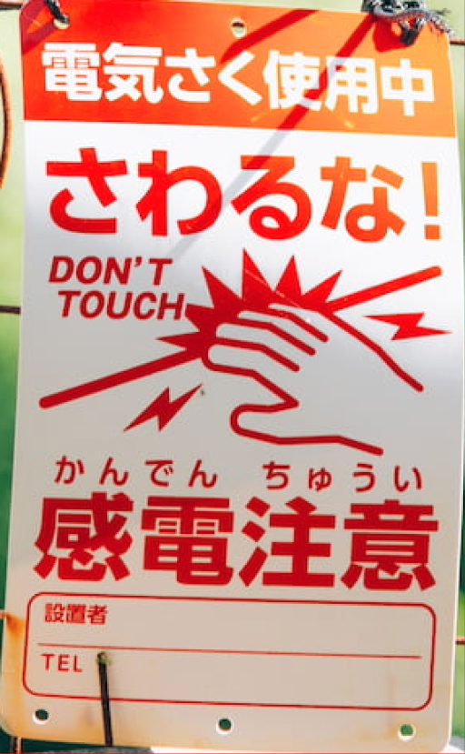
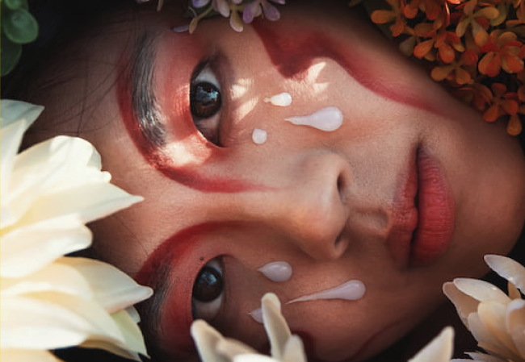
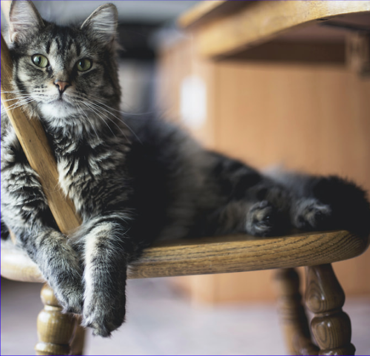

# caption-service

This service provides endpoints for retrieving captions based on a given image.

Apart from providing just an input image, the service also accepts a bounding box to generate a caption based on a cropped version image.

Please refer to the [proto file](../../shared/proto/services/caption_service/v1/caption_service.proto) for more information on the service's API.

## Requirements

- [Python 3.11.7](https://www.python.org/downloads/release/python-3117/)
  - I recommend to using [pyenv](https://github.com/pyenv/pyenv) to manage python versions
- [gRPCurl](https://github.com/fullstorydev/grpcurl)
- [Make](https://www.gnu.org/software/make/) (optional)
  - should be pre-installed on most Unix-like systems

## Setup

1. Clone [this repository](https://github.com/nico-i/photo-ops/tree/main) and navigate to the root directory.
2. Navigate to the `services/caption_service` directory.
3. Set up a python virtual environment with the pre-configured make command.
4. Install the required dependencies to the virtual environment.
5. Start the service. (optionally edit [the make file](./makefile) to change the port or disable debug mode)

The above steps can be executed with the following commands:

```bash
git clone https://github.com/nico-i/photo-ops.git
cd photo-ops
cd services/caption_service
make venv
make install
make dev
```

## Usage

If you have followed the setup instructions above, you can utilize the configured make commands to execute the example requests.

Please refer to [the make file](./makefile) or [the table below](#examples) for the available make commands.

## Examples

<table>
  <tr>
    <th>Make job</th>
    <th>Input image</th>
    <th>gRPCurl response</th>
  </tr>
  <tr>
  <td>
  
  ```bash
  make req_obj
  ```
  
  </td>
  <td></td>
  <td>
  
```json
{
  "caption": "a sign on a fence"
}
```

  </td>
  </tr>
  <tr>
  <td>
  
  ```bash
  make req_obj_crop
  ```
  
  </td>
  <td></td>
  <td>
  
```json
{
  "caption": "a sign in the city."
}
```

  </td>
  </tr>
  <tr>
  <td>
  
  ```bash
  make req_human
  ```

  </td>
  <td></td>
  <td>
  
```json
{
  "caption": "a girl with a flower in her hair"
}
```

  </td>
  </tr>
  <tr>
  <td>
  
  ```bash
  make req_human_crop
  ```

  </td>
  <td></td>
  <td>
  
```json
{
  "caption": "a girl with painted eyes and white makeup"
}
```

  </td>
  </tr>
  <tr>
  <td>
    
  ```bash
  make req_animal
  ```
    
  </td>
  <td></td>
  <td>
  
```json
{
"caption": "a cat is lying on a chair"
}
```

  </td>
  </tr>
    </tr>
  <tr>
  <td>
    
  ```bash
  make req_animal_crop
  ```
    
  </td>
  <td></td>
  <td>
  
```json
{
  "caption": "a cat is relaxing on a chair"
}
```

  </td>
  </tr>
</table>

## Credits

Example images used in the tests are from [Unsplash](https://unsplash.com/):

- [Object example](./docs/examples/obj.jpg) by [Atul Vinayak](https://unsplash.com/@atulvi?utm_content=creditCopyText&utm_medium=referral&utm_source=unsplash)
- [Person example](./docs/examples/person.jpg) by [Isabela Drasovean](https://unsplash.com/@isabeladrasovean?utm_content=creditCopyText&utm_medium=referral&utm_source=unsplash)
- [Animal example](./docs/examples/animal.jpg) by [Kari Shea](https://unsplash.com/@karishea?utm_content=creditCopyText&utm_medium=referral&utm_source=unsplash)
