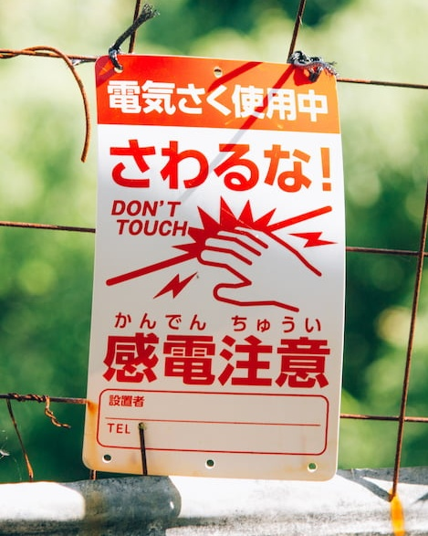

# Crop Service

The crop service is responsible for handling all operations related to cropping images.

## Endpoints

The service provides the following endpoints:

- `POST /v1/crop` — crops an image based on the provided parameters.
- `POST /v1/recommend` — recommends the best crop for an image based on the provided parameters.

# crop-service

This service provides endpoints for cropping images as well as recommending the best crop for an image.

Please refer to the [proto file](../../shared/proto/services/crop_service/v1/crop_service.proto) for more information on the service's API.

## Requirements

- [Python 3.11.7](https://www.python.org/downloads/release/python-3117/)
  - I recommend to using [pyenv](https://github.com/pyenv/pyenv) to manage python versions
- [gRPCurl](https://github.com/fullstorydev/grpcurl)
- [Make](https://www.gnu.org/software/make/) (optional)
  - should be pre-installed on most Unix-like systems

## Setup

1. Clone [this repository](https://github.com/nico-i/photo-ops/tree/main) and navigate to the root directory.
2. Navigate to the `services/crop_service` directory.
3. Set up a python virtual environment with the pre-configured make command.
4. Install the required dependencies to the virtual environment.
5. Start the service. (optionally edit [the make file](./makefile) to change the port or disable debug mode)

The above steps can be executed with the following commands:

```bash
git clone https://github.com/nico-i/photo-ops.git
cd photo-ops
cd services/caption_service
make venv
make install
make dev
```

## Usage

If you have followed the setup instructions above, you can utilize the configured make commands to execute the example requests.

Please refer to [the make file](./makefile) or [the table below](#examples) for the available make commands.

## Examples

The examples below use a target aspect ratio of 0.8, which is equivalent to a 4:5 aspect ratio popularized by Instagram.

<table>
  <tr>
    <th>Make job</th>
    <th>RPC</th>
    <th>Input</th>
    <th>Output</th>
  </tr>
  <tr>
  <td>
  
  ```bash
  make req_animal_rec
  ```

  </td>
  <td>

  `get_crop_suggestion`

  </td>

  <td>

```json
{
    "image_width": 1080,
    "image_height": 720,
    "target_aspect_ratio": 0.8,
    "image_motif": {
        "x": 219,
        "y": 65,
        "width": 680,
        "height": 655
    }
}
```
  </td>
  <td>
  
```json
{
  "cropSuggestion": {
    "x": 296,
    "y": 65,
    "width": 524,
    "height": 655
  },
  "invalidBounds": true
}
```

  </td>
  </tr>
  <tr>
  <td>
  
  ```bash
  make req_animal_crop
  ```

  </td>
  <td>

  `crop_image`

  </td>

  <td>

```json
{
  "output_path": "./services/crop_service/docs/img/animal_crop.jpg",
  "input_image": {
          "path": "test/images/animal.jpg"
  },
  "crop_spec": {
          "x": 296,
          "y": 65,
          "width": 524,
          "height": 655
  }
}
```

  </td>
  <td>
    
  </td>
  </tr>
  <tr>
  <td>
  
  ```bash
  make req_obj_rec
  ```
  
  </td>
    <td>

  `get_crop_suggestion`

  </td>
  <td>

```json
{
    "image_width": 1080,
    "image_height": 720,
    "target_aspect_ratio": 0.8,
    "image_motif": {
        "x": 428,
        "y": 195,
        "width": 286,
        "height": 463
    }
}
```
</td>
<td>

```json
{
  "cropSuggestion": {
    "x": 336,
    "y": 133,
    "width": 469,
    "height": 587
  }
}
```

</td>

  </tr>
   <tr>
  <td>
  
  ```bash
  make req_obj_crop
  ```

  </td>
  <td>

  `crop_image`

  </td>

  <td>

```json
{
  "output_path": "./services/crop_service/docs/img/object_crop.jpg",
  "input_image": {
          "path": "test/images/object.jpg"
  },
  "crop_spec": {
          "x": 336,
          "y": 133,
          "width": 469,
          "height": 587
  }
}
```
  </td>
  <td>
    
  </td>
  </tr>
  <tr>
  <td>
  
  ```bash
  make req_human_rec
  ```
  
  </td>
    <td>

  `get_crop_suggestion`

  </td>
  <td>

```json
{
    "image_width": 1080,
    "image_height": 721,
    "target_aspect_ratio": 0.8,
    "image_motif": {
        "x": 208,
        "y": 176,
        "width": 537,
        "height": 371
    }
}
```
</td>
<td>

```json
{
  "cropSuggestion": {
    "x": 188,
    "y": 2,
    "width": 575,
    "height": 718
  }
}
```

</td>

  </tr>
   <tr>
  <td>
  
  ```bash
  make req_human_crop
  ```

  </td>
  <td>

  `crop_image`

  </td>

  <td>

```json
{
  "output_path": "./services/crop_service/docs/img/human_crop.jpg",
  "input_image": {
          "path": "test/images/human.jpg"
  },
  "crop_spec": {
          "x": 188,
          "y": 2,
          "width": 575,
          "height": 718
  }
}
```

  </td>
  <td>
    
  </td>
  </tr>
</table>

## Credits

Example images used in the tests are from [Unsplash](https://unsplash.com/):

- [Object example](./docs/examples/obj.jpg) by [Atul Vinayak](https://unsplash.com/@atulvi?utm_content=creditCopyText&utm_medium=referral&utm_source=unsplash)
- [Person example](./docs/examples/person.jpg) by [Isabela Drasovean](https://unsplash.com/@isabeladrasovean?utm_content=creditCopyText&utm_medium=referral&utm_source=unsplash)
- [Animal example](./docs/examples/animal.jpg) by [Kari Shea](https://unsplash.com/@karishea?utm_content=creditCopyText&utm_medium=referral&utm_source=unsplash)
