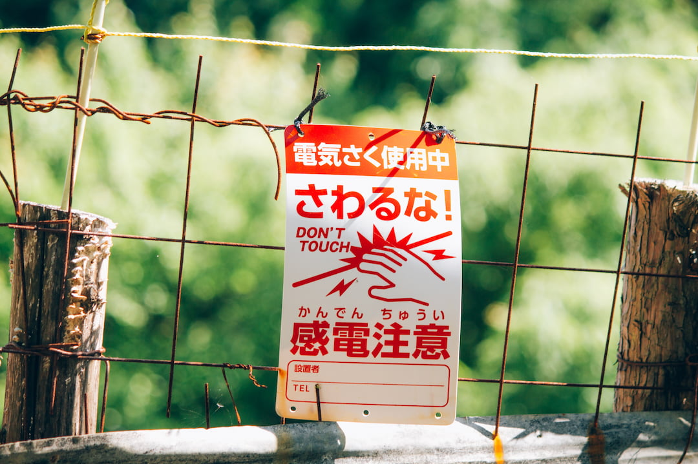
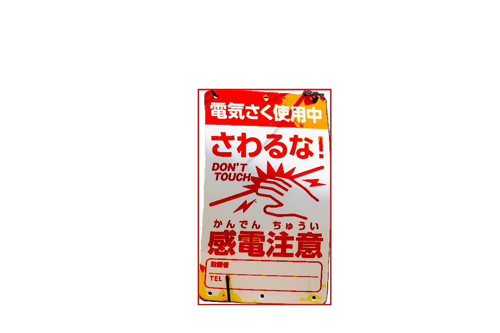
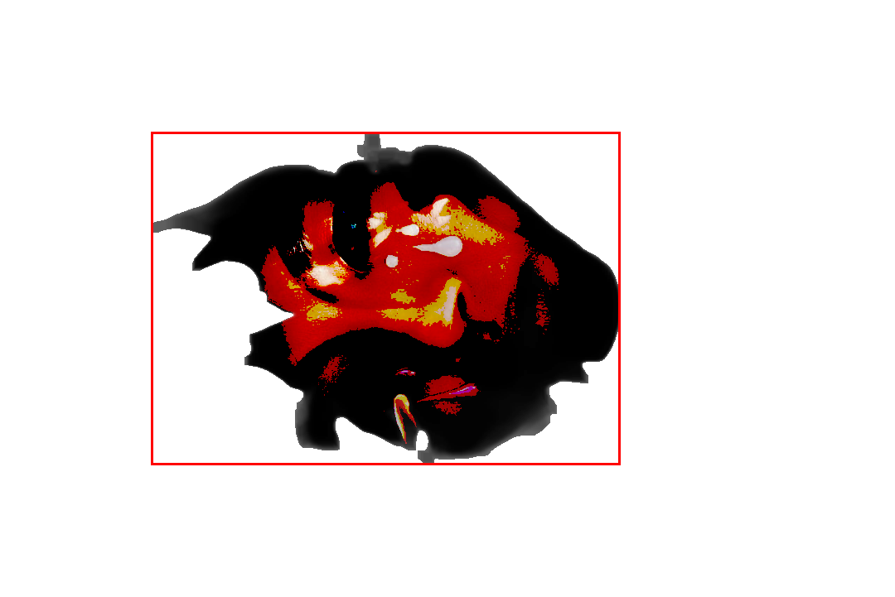
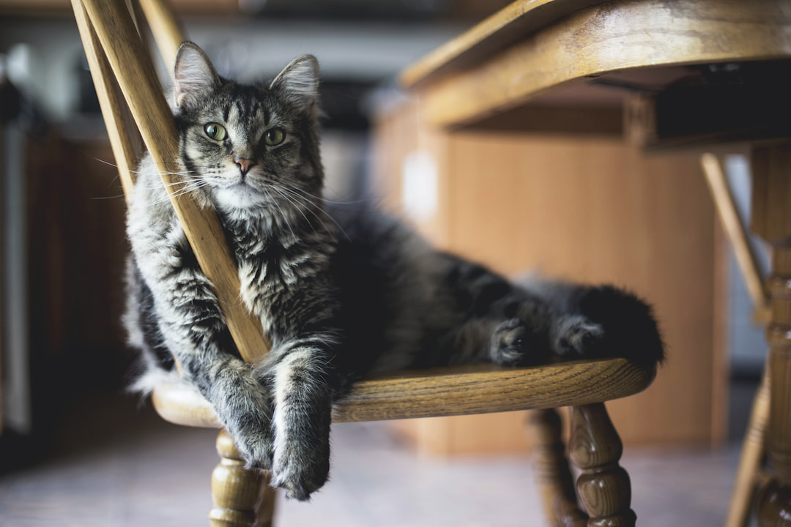
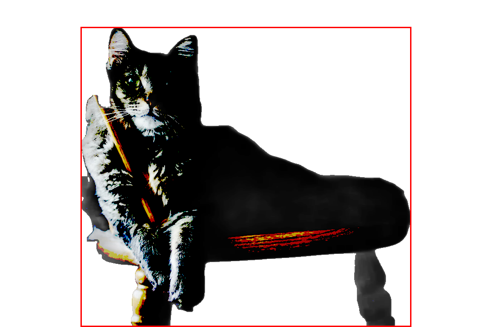

# motif-service

This service provides a bounding box for the motif i.e. the main subject of a given image via an http or gRPC calls.

By using the [rembg](https://github.com/danielgatis/rembg#rembg) library the service takes an input image and removes its background and outputs a mask.
Based on said mask, the service calculates the bounding box of the main subject and returns its information in the JSON format.
Optionally, the service can also return a debug image with the bounding box drawn on it.

## Examples

| Input                                      | Debug Image                                       | Output                                              |
| ------------------------------------------ | ------------------------------------------------- | --------------------------------------------------- |
|     |     | `{"x": 415,"y": 97,"width": 310,"height": 569}`     |
|  |  | `{"x": 426, "y": 119, "width": 288, "height": 540}` |
|  |  | `{"x": 176, "y": 63, "width": 726, "height": 656}`  |

## Dependencies

This service depends on the following repositories:

- `Go`
  - [grpc-gateway](https://github.com/grpc-ecosystem/grpc-gateway#grpc-gateway) — generation of gRPC stubs, OpenAPI specification and http gateway
- `Python`
  - [rembg](https://github.com/danielgatis/rembg#rembg) — removal of an image's background
  - [Pillow](https://github.com/python-pillow/Pillow#pillow) — denoising, bounding box calculation and drawing

## Credits

Example images used in the tests are from [Unsplash](https://unsplash.com/):

- [Object example](./docs/examples/obj.jpg) by [Atul Vinayak](https://unsplash.com/@atulvi?utm_content=creditCopyText&utm_medium=referral&utm_source=unsplash)
- [Person example](./docs/examples/person.jpg) by [Isabela Drasovean](https://unsplash.com/@isabeladrasovean?utm_content=creditCopyText&utm_medium=referral&utm_source=unsplash)
- [Animal example](./docs/examples/animal.jpg) by [Kari Shea](https://unsplash.com/@karishea?utm_content=creditCopyText&utm_medium=referral&utm_source=unsplash)
