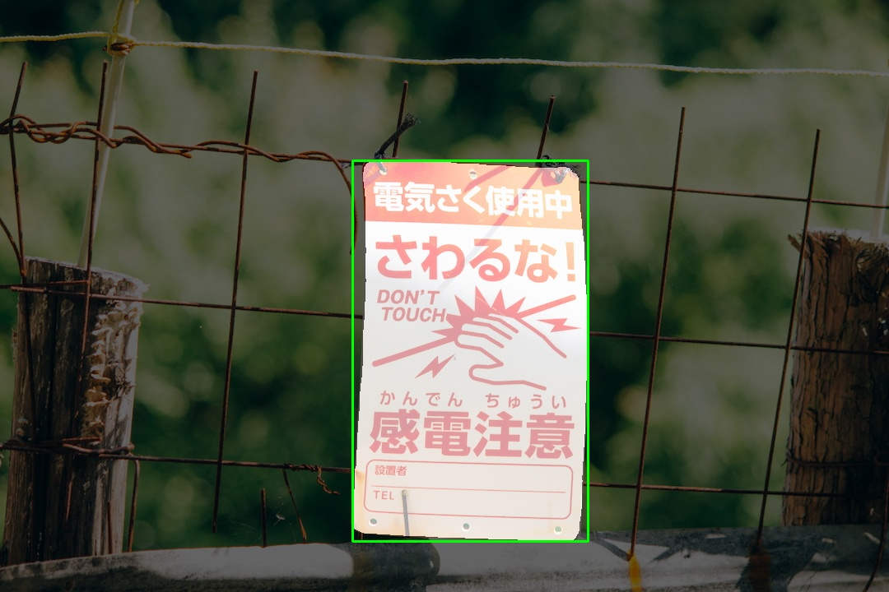
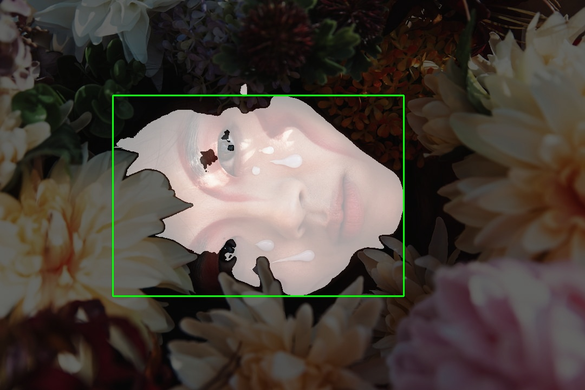
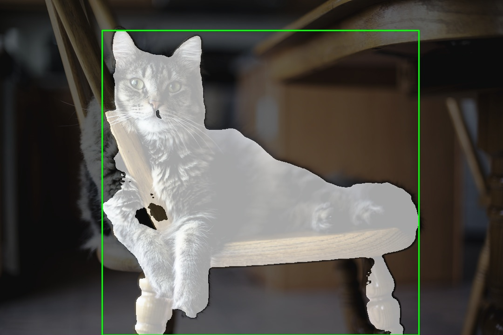

# motif-service

This service provides endpoints for retrieving the bounding box of the motif i.e. the main subject of a given image.

Please refer to the [proto file](../../shared/proto/services/motif_service/v1/motif_service.proto) for more information on the service's API.

## Requirements

- [Python 3.11.7](https://www.python.org/downloads/release/python-3117/)
  - I recommend to using [pyenv](https://github.com/pyenv/pyenv) to manage python versions
- [gRPCurl](https://github.com/fullstorydev/grpcurl)
- [Make](https://www.gnu.org/software/make/) (optional)
  - should be pre-installed on most Unix-like systems

## Setup

```bash
git clone https://github.com/nico-i/photo-ops.git
cd photo-ops
cd services/motif_service
make venv
make install
make dev
```

The code above does the following:

1. Clone [this repository](https://github.com/nico-i/photo-ops/tree/main) and navigate to the root directory.
2. Navigate to the `services/motif_service` directory.
3. Set up a python virtual environment with the pre-configured make command.
4. Install the required dependencies to the virtual environment.
5. Start the service. (optionally edit [the make file](./makefile) to change the port or disable debug mode)

## Usage

If you have followed the setup instructions above, you can utilize the configured make commands to execute the example requests.

Please refer to [the table below](#examples) for the available make commands. *Note: use the "debug" version of a make job to get the debug base64 image in the response.*

## Examples

<table>
  <tr>
    <th>Make job</th>
    <th>Input image</th>
    <th>gRPCurl debug response</th>
    <th>gRPCurl response</th>
  </tr>
  <tr>
  <td>
  
  `make req_obj` or `make req_obj_debug`
  
  </td>
  <td></td>
  <td></td>
  <td>
  
  ```json
  {
    "bBox": {
      "x": 428,
      "y": 195,
      "width": 286,
      "height": 463
    }
  }
  ```

  </td>
  </tr>
  <tr>
  <td>
    
  `make req_human` or `make req_human_debug`
    
  </td>
  <td></td>
  <td></td>
      <td>
  
  ```json
  {
    "bBox": {
      "x": 208,
      "y": 176,
      "width": 537,
      "height": 371
    }
  }
  ```

  </td>
  </tr>
  <tr>
  <td>
    
  `make req_animal` or `make req_animal_debug`
    
  </td>
    <td></td>
    <td></td>
        <td>
  
  ```json
  {
    "bBox": {
      "x": 219,
      "y": 65,
      "width": 680,
      "height": 655
    }
  }
  ```

  </td>
  </tr>
</table>

## Credits

Example images used in the tests are from [Unsplash](https://unsplash.com/):

- [Object example](./docs/examples/obj.jpg) by [Atul Vinayak](https://unsplash.com/@atulvi?utm_content=creditCopyText&utm_medium=referral&utm_source=unsplash)
- [Person example](./docs/examples/person.jpg) by [Isabela Drasovean](https://unsplash.com/@isabeladrasovean?utm_content=creditCopyText&utm_medium=referral&utm_source=unsplash)
- [Animal example](./docs/examples/animal.jpg) by [Kari Shea](https://unsplash.com/@karishea?utm_content=creditCopyText&utm_medium=referral&utm_source=unsplash)
